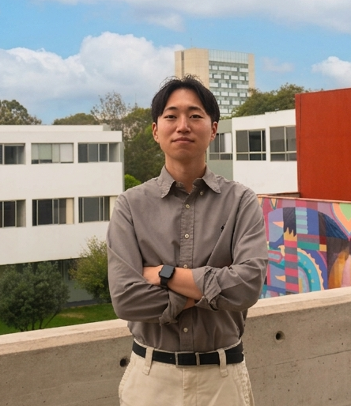

::: {.profile-section}

{.profile-photo fig-alt="Terrence Roh"}

::: {.profile-text}

# Terrence Roh

::: {.subtitle}
Ph.D. Candidate, Political Science | Massachusetts Institute of Technology
:::

::: {.bio}
I am a Ph.D. candidate in the [Department of Political Science](https://polisci.mit.edu/) at the Massachusetts Institute of Technology (MIT). My research focuses on **state development**, **urban slums**, and **identity politics** in the Global South, with a methodological emphasis on causal inference, experiments, and measurement.

I study how spatial fragmentation shapes collective action and governance in peripheral urban areas, and how ethnic representation produces spillover effects in diverse societies. My fieldwork spans Latin America, including Peru, Mexico, and Brazil.

Prior to MIT, I earned my M.A. and B.A. from Seoul National University, and worked as a research intern at the United Nations ECLAC in Santiago, Chile.
:::

<a href="mailto:troh@mit.edu">&#9993; troh[at]mit.edu</a>
<a href="https://github.com/troh">&#128187; GitHub</a>
<a href="https://scholar.google.com/citations?user=PLACEHOLDER">&#127891; Google Scholar</a>
<a href="https://www.linkedin.com/in/terrenceroh/">&#128101; LinkedIn</a>

::: {.affiliations}
**Affiliations:** [MIT Global Diversity Lab](https://gdl.mit.edu/) · [MIT Latin America Working Group](https://polisci.mit.edu/)
:::

:::

:::
